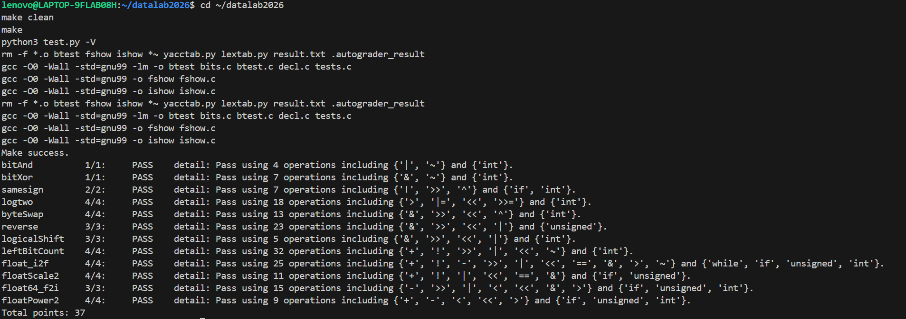

# Data Lab 实验报告

姓名：谢秉奇
学号：2025203020

## 实验结果

| 总分 | bitAnd | bitXor | samesign | logtwo | byteSwap | reverse |
|---:|---:|---:|---:|---:|---:|---:|
| 37/37 | 1/1 | 1/1 | 2/2 | 4/4 | 4/4 | 3/3 |

| logicalShift | leftBitCount | float_i2f | floatScale2 | float64_f2i | floatPower2 |
|---:|---:|---:|---:|---:|---:|
| 3/3 | 4/4 | 4/4 | 4/4 | 3/3 | 4/4 |

测试命令：

```bash
make
python3 test.py
```

测试结果如下，所有函数均通过正确性与合法性检查，总分为 37 分。



## 解题报告

### 亮点

1. `float_i2f`：完整处理符号、`INT_MIN`、有效位定位以及 IEEE 754 向偶数舍入。
2. `logtwo` 与 `leftBitCount`：使用 16、8、4、2、1 的分段二分思想，避免逐位循环。
3. `reverse`：通过五轮分组交换完成 32 位整体反转，结构清晰且操作数较少。

### bitAnd

根据德摩根律：

```text
x & y = ~(~x | ~y)
```

先分别对 `x`、`y` 取反，再进行按位或，最后整体取反。这样只使用题目允许的 `~` 和 `|`，并得到与 `x & y` 完全相同的逐位结果。

### bitXor

异或要求两个输入位不相同。`x & y` 表示两位同时为 1，`~x & ~y` 表示两位同时为 0；分别取反后再按位与，就排除了这两种“相同”的情况：

```c
return ~(x & y) & ~(~x & ~y);
```

该写法恰好使用 7 个允许的操作符。

### samesign

先单独处理零，因为题目规定零既不是正数也不是负数，但两个零同号。对于两个非零整数，算术右移 31 位可以取得符号扩展结果；两者异或为 0 表示符号相同，再使用 `!` 将结果规范化为 1。

```c
if (!x)
    return !y;
if (!y)
    return 0;
return !((x >> 31) ^ (y >> 31));
```

### logtwo

对于正整数，`floor(log2(v))` 等于最高有效位的位置。我依次判断高 16 位、高 8 位、高 4 位、高 2 位和最后 1 位是否存在有效位；每次确定一段后，就将该段移出并累加位数。

例如第一次判断：

```c
shift = (v > 0xFFFF) << 4;
v >>= shift;
result |= shift;
```

比较结果只有 0 或 1，左移 4 位后得到 0 或 16。后续以相同方式处理 8、4、2、1 位，从而在固定步骤内找到最高位。

### byteSwap

字节编号乘 8 即为对应位移量，因此使用 `n << 3` 和 `m << 3` 定位两个字节。右移后与 `0xFF` 得到两个目标字节，再计算它们的异或差异。

```c
int difference = nbyte ^ mbyte;
```

将该差异分别移动回两个字节的位置并与原数异或，只翻转两个字节之间不同的位，因此无需先清空原字节即可完成交换。当 `n == m` 时差异为 0，原数保持不变。

### reverse

我采用分治式的分组交换。首先利用 `0x55555555` 交换相邻的单个位，然后依次交换 2 位组、4 位组、8 位组和 16 位组：

```text
0x55555555  交换相邻 1 位组
0x33333333  交换相邻 2 位组
0x0F0F0F0F  交换相邻 4 位组
0x00FF00FF  交换相邻 8 位组
最后交换高、低 16 位
```

经过五轮交换后，每一位都移动到关于 32 位中心对称的位置，完成整体反转。

### logicalShift

C 对负的 `int` 右移通常进行算术右移，会在高位补 1。为得到逻辑右移结果，我构造一个低 `32-n` 位为 1、高 `n` 位为 0 的掩码：

```c
int mask = ((0x7FFFFFFFu >> n) << 1) | 1;
return (x >> n) & mask;
```

算术右移产生的高位补 1 会被掩码清除。该构造也能正确处理 `n == 0` 和 `n == 31`。

### leftBitCount

先对 `x` 取反，把“统计前导连续 1”转换成“统计前导连续 0”。随后按 16、8、4、2、1 位分段判断：若当前高位分段全为 0，就把该段长度计入结果，并将剩余部分左移到最高位继续判断。

这种二分方法最多执行固定的六次判断。对于 `x == -1`，取反后为全 0，所有分段都会计入，最终返回 32。

### float_i2f

该函数将整数转换为 IEEE 754 单精度位表示。首先提取符号位，并以 `unsigned` 保存绝对值，从而能够处理 `INT_MIN`。然后从第 31 位开始寻找最高有效位 `highest`。

若有效位不超过 24 位，直接左移对齐；否则保留最高 24 位，并记录被丢弃部分：

```c
remainder = magnitude & ((1u << extra) - 1);
halfway = 1u << (extra - 1);
```

当被丢弃部分大于一半时进位；恰好等于一半时根据当前最低保留位决定是否进位，实现 IEEE 754 的“舍入到最近值，恰好一半时舍入到偶数”。最终将符号、指数和有效数字组合。舍入产生的尾数进位也会自然传播到指数部分。

### floatScale2

先用 `0x7F800000` 提取指数。若指数全为 1，输入是 NaN 或无穷大，直接返回原值。若指数为 0，输入是零或非规格化数，保留符号位并将有效部分左移一位。若指数为 254，乘 2 后会溢出为带原符号的无穷大。其余规格化数只需给指数加 1：

```c
return uf + 0x00800000;
```

当最大非规格化数乘 2 时，左移会自然进入最小规格化数。对指数为 254 的数单独返回无穷大，可以避免保留原 fraction 而误生成 NaN。

### float64_f2i

双精度数的高 32 位包含符号位、11 位指数和 fraction 的高 20 位。先提取：

```c
sign = uf2 >> 31;
exponent = (uf2 >> 20) & 0x7FF;
```

双精度指数偏置为 1023。若指数小于 1023，数值绝对值小于 1，向零舍入结果为 0；若指数大于 `1023 + 31`，则一定超出 32 位有符号整数范围。

随后补上规格化数隐含的最高位 1，并拼接 fraction 的最高 31 位。构造出的最高有效位位于第 31 位，因此右移 `1054 - exponent` 位即可把它移动到真实指数位置，同时丢弃小数部分，实现向零舍入。最后分别检查正数上限 `0x7FFFFFFF` 和负数绝对值上限 `0x80000000`。

### floatPower2

根据单精度浮点数的表示范围分四段处理：

```text
x < -149          太小，返回 0
-149 <= x < -126  非规格化数，在 fraction 中设置一位
-126 <= x <= 127  规格化数，指数为 x + 127，fraction 全为 0
x > 127           溢出，返回 +INF
```

规格化的二的整数次幂都可写成 `1.000... x 2^x`，因此 fraction 全为 0，只需把偏置后的指数移动到第 23 位。非规格化范围则使用 `1u << (x + 149)` 设置对应 fraction 位。

## 反馈、收获与总结

本实验让我更直观地理解了补码、移位、掩码以及 IEEE 754 浮点数的编码方式。整数题中，分组交换和二分定位能显著减少操作数；浮点题中，边界值、非规格化数和舍入规则比普通计算更重要。通过 `btest` 检查正确性，再用 `test.py` 检查操作符合法性，可以较快定位实现问题。最终全部测试通过。

## 参考的重要资料

1. Randal E. Bryant, David R. O'Hallaron, *Computer Systems: A Programmer's Perspective*, Chapter 2: Representing and Manipulating Information.
2. IEEE 754 浮点数标准简介：https://en.wikipedia.org/wiki/IEEE_754
3. Data Lab 仓库说明：https://github.com/RUCICS2026/datalab2026
